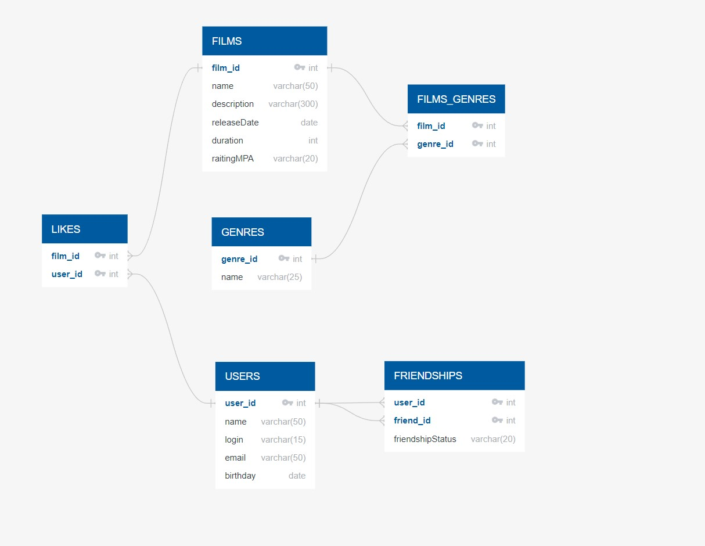

# Filmorate project
***
## ER Схема

#### Описание схемы:
 1. __Films__ - содержит данные о фильмах. 
    1.1 В связанной с ней по первичному коючу таблице __Likes__ хранятся данные о лайках фильмов в разрезе фильмов и пользователей.
    1.2 Рэйтинг MPA будет установлен соответствующим _ENUM_ наименование значения которого хранится в поле __raitingMPA__

2. __Genres__ - содержит список жанров фильмов

3. __Users__ - содержит данные о пользователях

4. __Friendships__ - содержит информацию о дружбах пользователей , значение статуса дружбы хранится в   поле __friendshipStatus__ и содержит наименование значения _ENUM_ 
_____
####Основные запросы

###### Пользователи

___Получить пользователя по id___
SELECT * FROM "Users" WHERE "user_id" = 1

___Получить список друзей___ 
SELECT "friend_id" FROM "Friendships" WHERE "user_id" = 1

___Добавить в друзья___
INSERT INTO "Friendships" ("user_id", "friend_id", "friendshipStatus")
VALUES (1,2,'unconfirmed') 

___Удалить из друзей___
DELETE FROM "Friendships" WHERE "user_id" = 1 AND "friend_id" = 2

###### Фильмы

___Добавить лайк___
INSERT INTO "Likes" ("film_id","user_id") 
VALUES (1,1)

___Удалить лайк____
DELETE FROM "Likes" WHERE "film_id" = 1 AND "user_id" = 2

___Получить ТОП 10 самых популярных фильмов___
SELECT "film_id"
FROM "Likes"
GROUP BY "film_id"
ORDER BY  COUNT("user_id") DESC
LIMIT 10

